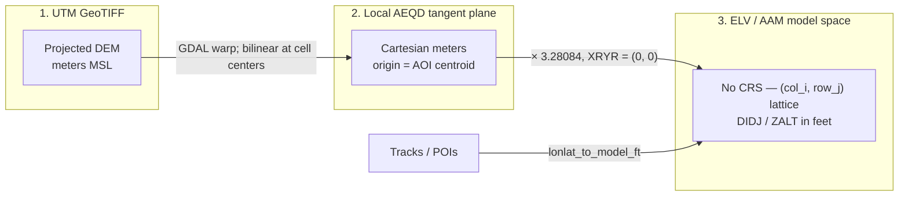
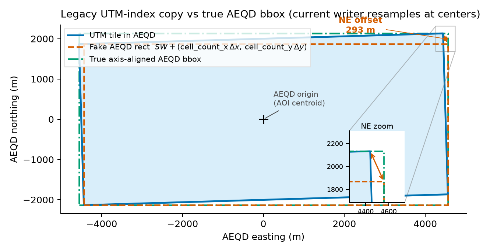
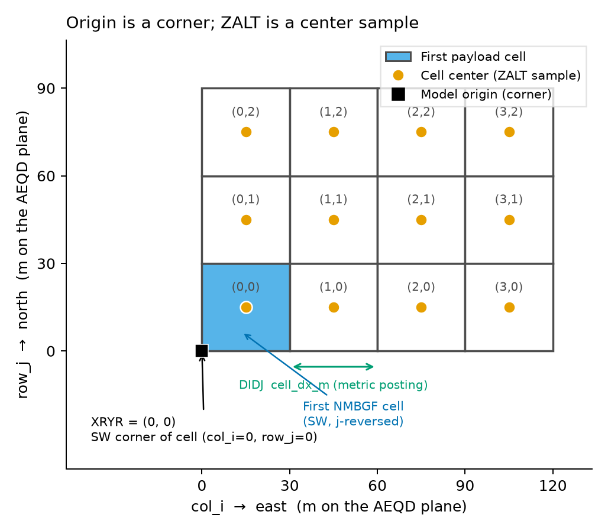
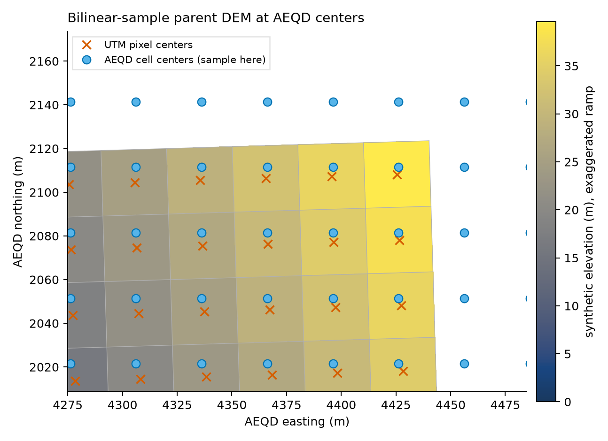

# DEM → AAM ELV pipeline

Reference for the AEQD resample implemented in ``write_elv.py``. Regenerating figures:

```
uv pip install matplotlib   # not a runtime dependency
python docs/generate_elv_pipeline_figures.py
```

## Three spaces

| Space | CRS | Units / lattice |
| --- | --- | --- |
| **UTM GeoTIFF** (any projected DEM) | native DEM CRS | pixel values in **meters MSL** |
| **Local AEQD tangent plane** | `+proj=aeqd +lat_0 +lon_0 +datum=WGS84 +units=m` from the AOI envelope centroid | continuous Cartesian **meters**. The CRS exists only to define the plane. |
| **ELV / AAM model space** | **none** | regular `(col_i, row_j)` lattice. `XRYR=(0,0)`, `DIDJ` in **feet**, `ZALT` in **feet**. First payload cell is SW (column-major, j-reversed). `row_j=0` is south. |



## Grid types

- **`BoundsM`** (`grid_spec.py`) — axis-aligned bounds in meters: `xmin_m`, `ymin_m`, `xmax_m`, `ymax_m`.
- **`GridSpec`** — regular north-up lattice: `cell_count_x` / `cell_count_y`, `cell_dx_m` / `cell_dy_m`, `grid_origin_x_m` / `grid_origin_y_m` (SW corner of cell `(0, 0)`). `grid_extent_*_m` properties give the snapped NE corner after ceiling cell counts.
- **`AeqdGrid`** (`aeqd_grid.py`) — elevation lattice in AEQD; composes a `GridSpec` via `.spec` (also carries `aeqd_crs`, GDAL `transform`, and snapped `grid_extent_*_m`).
- **`TerrainResult`** (`context.py`) — post-ELV state for tracks/POIs; composes `GridSpec` via `.spec` plus `aeqd_crs`.

## Intended pipeline

1. **Inputs:** parent DEM + AOI (WGS84). Cell size `cell_dx_m` / `cell_dy_m` comes from the DEM posting at the AOI centroid (`dem_posting_meters_from_src`) — metric only; never put degrees in `DIDJ`.
2. **AOI envelope** — axis-aligned WGS84 bounds of the AOI (`aoi_envelope`). **Build AEQD CRS** from the envelope centroid (`build_aeqd_crs` → `aeqd_crs`).
3. **Window** the source DEM in its native CRS if you like (optional preprocess). That window is **not** the ELV grid; the writer reprojects the open raster via GDAL warp.
4. Transform the AOI envelope **and** parent DEM footprint to AEQD; take the axis-aligned bbox of their **union** as `BoundsM` (`merge_bounds`), then snap a covering rectangle (`build_aeqd_grid`). `cell_count_x = ceil(width / cell_dx_m)`, `cell_count_y = ceil(height / cell_dy_m)`. `grid_origin_*_m` is the SW corner; `grid_extent_*_m` is the snapped NE corner. Reject AOIs that extend past the DEM (`assert_aoi_within_dem_src`).
5. Cell **corners:** SW of cell `(col_i=0, row_j=0)` is the model origin (`grid_origin_x_m`, `grid_origin_y_m`). Cell **centers** (where Z is sampled):

   `center = (grid_origin_x_m + (col_i + 0.5)·cell_dx_m, grid_origin_y_m + (row_j + 0.5)·cell_dy_m)`

6. **Bilinear-sample** the parent DEM at those geographic centers (GDAL warp onto the AEQD affine). Fill nodata **after** resample, not before.
7. **Write NMBGF:** `FEET`, `DIDJ = cell_dx_m · 3.28084`, `XRYR = (0, 0)`, `ZALT = z_m · 3.28084`. `_clip.tif` should be this AEQD grid.
8. **Tracks / POIs:** `lonlat_to_model_ft` chains three steps — `_wgs84_to_aeqd_m` → `_aeqd_m_to_model_ij` (fractional `col_i`, `row_j`) → `_model_ij_to_ft`.

## Current behavior

``write_elv_from_dem`` builds a regular AEQD lattice, bilinear-resamples the parent DEM onto it, fills nodata **after** resample, and writes that grid to both ``_clip.tif`` (meters, ``aeqd_crs``) and ``.ELV`` (feet).

The ``_clip.tif`` sidecar is for debugging only (AAM does not read it). Each rerun overwrites it; if the file is open in a GIS viewer, the write may fail with a permission error until you close the viewer (most common on Windows).

## Constants

- `FT_PER_M = 3.28084` (AAM / TERRAINCHK, **not** 3.280839895).
- FLOW stays **mks rayls** (do not multiply by `FT_PER_M`).

## Figures

Synthetic geometry (UTM zone 6N, ~9 km × 4 km at 63.73°N, −148.90°). Not a Denali DEM.

**Figure 1 — UTM rectangle vs true AEQD bbox (the horizontal lie).** Legacy UTM-index copy treated pixels as if they sat on the dashed rectangle; the current writer bilinear-resamples onto AEQD cell centers (see [Current behavior](#current-behavior)).



**Figure 2 — cell corner vs cell center.** Origin is a corner; `ZALT` is a center sample.



**Figure 3 — sampling.** Bilinear-sample the parent DEM at AEQD centers — they do not coincide with UTM pixel centers.


