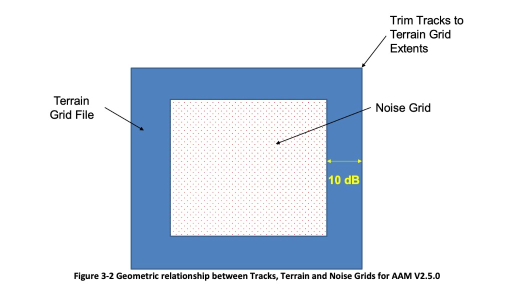

# AAM `.inp` format — short reference

Scope: **single-event** `.inp` files (manual §3.5.1). Terminology: [`glossary.md`](glossary.md). NMBGF terrain files (`.ELV`/`.IMP`/`.GRD`): [`aam_nmbgf.md`](aam_nmbgf.md). Full manual: [`manuals/aam_v3_manual.txt`](../manuals/aam_v3_manual.txt).

**Pre-run overview** (in `nmsim-aam-experiments`): `python3 scripts/dev/inp_overview.py path/to/scenario.inp`

---

## Units and coordinate frame (§3.5)

AAM `.inp` data use **British Standard Units**: horizontal distances in **feet**, speeds in **knots**, angles in **degrees** (manual §3.5, assumptions 1–5).

All horizontal positions in the file — `SETUP PARA` corners, `ONE TRACK` x/y, `POI` x/y — share one **user model-foot frame**: a Cartesian plane you define, not UTM or an EPSG code. With `TERRAIN`, track **Z** is **MSL ft**; POI **z** is **AGL ft**.

How you build `.ELV`/`.IMP` from a real-world DEM is separate from the `.inp` syntax; see [`aam_nmbgf.md` — This package's convention](aam_nmbgf.md#this-repos-convention) and [`docs/elv_pipeline.md`](../../docs/elv_pipeline.md).

---

<a id="two-grids-one-frame"></a>

## Two grids, one frame

Manual **§3.4 Data Grids**, **Figure 3-2**. AAM uses two nested horizontal grids:

| Grid | Where defined | Role |
|------|---------------|------|
| **Noise / calculating grid** | `SETUP PARA` (lines 2–3) | Acoustic workspace: track, POI block, and map output (`COMPUTEPLT` / `COMPUTEGRD`) |
| **Terrain grid** | `.ELV` / `.IMP` NMBGF headers | Finer ground elevation and flow-resistivity samples |



*Figure 3-2 (manual; PNG gitignored — copy locally from the vendor PDF):* terrain grid file must encompass the noise calculation grid **and** tracks; the margin outside the noise grid should be large enough that levels at the terrain edge are ≥10 dB below the peak (metric standards).

**Rules (same user model feet throughout):**

- **`TERRAINCHK`** (startup, when `TERRAIN` is set) aborts if the **SETUP PARA** calculating-grid rectangle is not fully covered by the **`.ELV`** extent (`XRYR` + `NINJ`×`DIDJ`, converted to model feet), and if any track point falls outside that same calculating grid. The manual also documents an analogous grid-vs-**`.IMP`** check; in practice only **ELV `XRYR`** alignment has been observed to trip failures.
- **Figure 3-2** additionally recommends a **buffer** between the noise grid and terrain edges so levels at the terrain boundary are ≥10 dB below peak — that supports metric standards but is **not enforced by `TERRAINCHK`**.
- **`XRYR`** is **not** a `.inp` keyword — it lives in the **`.ELV`/`.IMP` header**: user (x, y) of terrain cell **(1, 1)** (lower-left / SW corner of the terrain raster). Extent follows from `XRYR`, `NINJ`, and `DIDJ`. ELV and IMP headers should use the **same** `XRYR` (see [`aam_nmbgf.md`](aam_nmbgf.md)).
- **`SETUP PARA` does not have `XRYR`.** Its lines 2–3 are the calculating-grid corners in the **same** user frame as `XRYR`.

**Common pattern:** place the calculating-grid lower-left at the terrain SW corner (`XRYR` at the same point, often `(0, 0)`). That passes **`TERRAINCHK`** but may leave **zero west/south buffer** — Figure 3-2's all-side margin usually means **inset** `SETUP PARA` corners or a terrain extent that extends past the noise grid on every side.

---

## Scenario at a glance

Worked examples with fixture files and `inp_overview.py` output live in **`nmsim-aam-experiments`** (`compare/fixtures/aam_flat.inp`, `compare/fixtures/aam_terrain.inp`). Abbreviated skeletons below.

### Flat homogeneous ground

```
REM  AAM Tutorial poitime.inp …
COMPUTEPOI
DIAGNOSTICS
SETUP PARA
       100       100        5.
     -2000     -2000        0.
      2000      2000
        90     50000       200     0.0
CH146
1
      0.00      0.00      0.00
0
0
ONE TRACK
Southwesterly Accelerating Flight
2
  7000    7000    750.    …    40.0    …      90.
 -7000   -7000    750.    …   116.0    …      90.
POI
5
Mic1 -1000.0   1000.0      5.0
…
END
```

### Terrain case

```
REM matched NMSim/AAM comparison case …
COMPUTEPOI
DIAGNOSTICS
TERRAIN
scenario.elv
scenario.imp
SETUP PARA
       300       300       0.0
         0         0       5.2
    26700.0000     9600.0000
        40     60000       200       0.0
FLATO200
1
      0.00      0.00      0.00
0
0
ONE TRACK
Straight level overflight
61
     3696.62     4809.37    4251.8  …  136.1  …   90.
  …                                        ← 61 track points (Table 3-20)
POI
1
Receiver        13537.11     4501.31    5.25
END
```

Post-run: AAM always writes **`{basename}.txt`**. **`DIAGNOSTICS`** adds supplemental trace to that same file (not required for **SETUP PARAMETERS** / **Terrain Information**).

---

<a id="quick-reference-351"></a>

## Quick reference (§3.5.1)

| Mode keyword | Receivers in `.inp` | Extra lines | Output |
|--------------|---------------------|-------------|--------|
| `COMPUTEPOI` | `POI` block (receivers) + `ONE TRACK` (source path) | — | `.POI` time history |
| `COMPUTEPLT` | none (grid from `SETUP PARA`) | — | `.PLT` event metrics |
| `COMPUTEGRD` | none | metric name(s), e.g. `SELA` | `.GRD` NMBGF contour |

One mode per run (Table 3-6 fn. 4). Shared blocks: `SETUP PARA`, vehicle, `ONE TRACK`, optional `TERRAIN`, `END`. Keyword details: **§3.5.1.3**.

---

## File skeleton — COMPUTEPOI with terrain

```
REM {comment…}                           optional
COMPUTEPOI
DIAGNOSTICS                              optional
TERRAIN                                  omit for flat homogeneous ground
{elv_path}                               no spaces in path
{imp_path}
SETUP PARA
  {Δx_ft}      {Δy_ft}      {ground_MSL_ft}     flat: homogeneous ground MSL; TERRAIN: 0.0
  {LL_x_ft}    {LL_y_ft}    {receiver_AGL_ft}
  {UR_x_ft}    {UR_y_ft}
  {Δβ}         {cutoff_ft}  {flow_ρ}   {decoherence}   proximity / propagation (see glossary)
{vehicle_id}                             ≤5 chars → NCfiles/{id}.nc
1
  {orient_x}   {orient_y}   {orient_z}          vehicle orientation (manual §3.5.1.3)
0
0
ONE TRACK
{title}
{n_points}                               ONE TRACK: manual 500 max; AAM 3.0.0 binary 400 max (Tier 4b)
  {x_ft}  {y_ft}  {z_ft}  …  {speed_kn}  …  {heading_deg}   z: MSL if TERRAIN, else AGL
  …                                      {n_points} lines (Table 3-20)
POI
{n_poi}                                  max 500
{name}  {x_ft}  {y_ft}  {z_AGL_ft}
END
```

Flat runs omit `TERRAIN` / `.elv` / `.imp`.

**`COMPUTEGRD`:** `COMPUTEGRD` → metric line(s) → same core blocks, **no `POI`**. Example: AAM manual §5.2 `noisecon.inp` (vendor tutorial on the data drive).

**`COMPUTEPLT`:** like `COMPUTEGRD` but no metric lines → `.PLT`.

---

## `SETUP PARA`

Defines the **calculating (noise) grid** (Table 3-25, §3.5.1.3). Placeholders match the [file skeleton](#file-skeleton-computepoi-with-terrain) above.

| Line | Placeholder | Units | Meaning |
|------|-------------|-------|---------|
| 1 | `{Δx_ft}` `{Δy_ft}` `{ground_MSL_ft}` | ft | Cell spacing along x and y (min 100 ft each). Third field: **flat** — homogeneous ground elevation **MSL** (track Z is AGL above this). **TERRAIN** — use `0.0`; ground comes from `.ELV`. |
| 2 | `{LL_x_ft}` `{LL_y_ft}` `{receiver_AGL_ft}` | ft | **Lower-left** corner of the calculating grid (user model feet). Third field: default receiver / grid reference height **AGL** (typically ~5 ft). |
| 3 | `{UR_x_ft}` `{UR_y_ft}` | ft | **Upper-right** corner of the calculating grid. Must lie inside the `.ELV` extent with line 2 when `TERRAIN` is on (`TERRAINCHK`). |
| 4 | `{Δβ}` `{cutoff_ft}` `{flow_ρ}` `{decoherence}` | —, ft, kPa·s/m², rad·s/√ft | **Propagation and compute pruning** — [glossary — propagation parameters](glossary.md#aam-propagation-parameters-setup-para-line-4). `{Δβ}` + `{cutoff_ft}` decide when AAM runs full propagation vs skips a source–receiver pair as too far / too attenuated; `{flow_ρ}` flat earth only (`TERRAIN` → `.IMP`); `{decoherence}` turbulence when propagation runs. |

`ONE TRACK` and `POI` x/y use this same user model-foot frame.

For `COMPUTEPOI`, AAM reports `Grid Size (iX,iY) = 0 0` in `{basename}.txt` — no map cells — but corners still define the coordinate frame and `TERRAINCHK`.

---

## Block notes

Details not spelled out in the [skeleton](#file-skeleton-computepoi-with-terrain). Keyword tables: manual **§3.5.1.3**.

| Block | Notes |
|-------|-------|
| **Vehicle** | `{vehicle_id}` — max **5** characters; spectra file `NCfiles/{vehicle_id}.nc`. Next four lines: orientation / sphere count (manual §3.5.1.3). |
| **`ONE TRACK`** | Source path vertices (Table 3-20). Manual: **500 max** segments. **AAM 3.0.0 (empirical): 400 max** on input segment count — see [Batch limits](#batch-limits-computepoi). Track **z**: **MSL** with `TERRAIN`, **AGL** without. ActiveSpace reciprocity: **N track points + 1 POI receiver**. |
| **`POI`** | Receiver locations (Table 3-22). Manual: **500 max** named receivers; **z** is always **AGL** ft. Multi-POI grid mode (NMSim `.tig` analogue). Not the ActiveSpace batching cap when using 1 fixed mic. |
| **`TERRAIN`** | `{elv_path}` and `{imp_path}` — **no spaces** in paths. Loads `.ELV` / `.IMP` (NMBGF); grid fit vs calculating grid: [Two grids](#two-grids-one-frame). NMBGF headers: [`aam_nmbgf.md`](aam_nmbgf.md). |

Post-run: AAM always writes a primary ASCII log **`{basename}.txt`** (same basename as `.inp`): echoed input and **SETUP PARAMETERS**; with **`TERRAIN`**, also **Terrain Information** (ELV/IMP extent). Failed **`TERRAINCHK`** aborts the run (errors in the log). **`DIAGNOSTICS`** is optional — it adds extra trace (interpolated track, propagation internals), not the summary blocks above.

---

<a id="batch-limits-computepoi"></a>

## Batch limits (`COMPUTEPOI`)

The manual documents **two** independent caps (AAM v3 §3.5.1.3, Tables 3-20 and 3-22):

| Block | Manual limit | Role |
|-------|--------------|------|
| **`ONE TRACK`** | 500 segments max | Source path vertices (moving or snapshot hops) |
| **`POI`** | 500 receivers max | Fixed receiver locations |

**ActiveSpace reciprocity** uses **1 `POI` + N `ONE TRACK` points** — the binding cap is **`ONE TRACK`**, not `POI`.

**Empirical (AAM 3.0.0, Docker+Wine, Aug 2026):** `ONE TRACK` input count **fails above 400** (`READ ERROR … exceeds 400` in `{basename}.txt`). **500 segments is rejected** even though Table 3-20 says 500 max. **400 segments succeeds** with one POI row per vertex (`activespace-experiments/tier4b_aam_500_point_smoke.py`).

**A 1-point `ONE TRACK` also fails** (Wine exit 152, empty `.POI`), even with a dummy positive speed. The log stops after the track table — it never writes `Interpolated Track for analysis`. `write_inp` allows `speed_kn=0` for N=1; this binary still needs **at least two vertices**. A ~1 m pad hop works (2 POI rows). `speed_kn=0` on N>1 is the documented `INTRTIME` reject.

**Do not swap geometry** (1 track + N POIs) for ActiveSpace: it is the wrong reciprocity over terrain, and it hits the same 1-vertex crash. `COMPUTEGRD` is the wrong product (scalar map metrics, not per-band spectra at the mic).

**Batch-size timing** (`activespace-experiments/tier4c_batch_timing.py`, ridge line, `hop_speed_kn` ≈ 15 kn, 1:1 rows, no subdivision):

| Packing | Docker wall | AAM Start/Stop |
|---------|-------------|----------------|
| 1 × 400 track | **4.2 s** | 1.07 s |
| 8 × 50, each `docker run` | **33 s** (7.9×) | ~0.6 s × 8 |
| 8 × 50, one container, sequential `wine` | **17 s** (4.0×) | same AAM work |
| Linear fit (AAM internal) | — | **0.45 s fixed + 1.6 ms/point** (r² 0.98) |

Docker+Wine startup (~3 s) plus AAM terrain setup (~0.45 s) dominate. Extra track points are nearly free. `DIAGNOSTICS` off does not help. Prefer **400-point** `ONE TRACK` batches (empirical cap; extra points are cheap vs Wine/terrain startup). A below-ground vertex or interpolated hop aborts the **entire** track — prefilter or split hops **before write**; do not binary-split a failed batch as a retry (that just multiplies process launches). A 48×48 mesh (~2304 sources) ≈ **6 × 400-point runs (~25 s sequential)** vs ~47 × 50-point runs (~3 min sequential).

Other manual “500” limits (roads, quarry ops, `FLTTRK` curved-segment resolution) are unrelated to `ONE TRACK` snapshot batching.

---

## Manual index ([`manuals/aam_v3_manual.txt`](../manuals/aam_v3_manual.txt))

| Topic | Section |
|-------|---------|
| Data grids (terrain vs noise grid) | **§3.4**, Figure 3-2 |
| Units, keyword overview | **§3.5** |
| Single-event format | **§3.5.1**, keyword tables **§3.5.1.3** |
| Keyword summary | Table 3-6 |
| ONE TRACK | Table 3-20 |
| POI | Table 3-22 |
| SETUP PARA | Table 3-25 |
| TERRAIN | Table 3-38 |
| TERRAINCHK errors | `TERRAINCHK` (~L12500) |
| COMPUTEPOI / GRD / PLT tutorials | Figure 5-10 / 5-2 / 5-5 |
